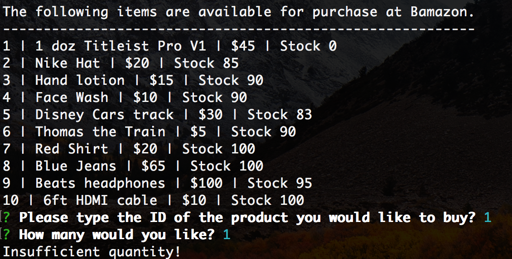
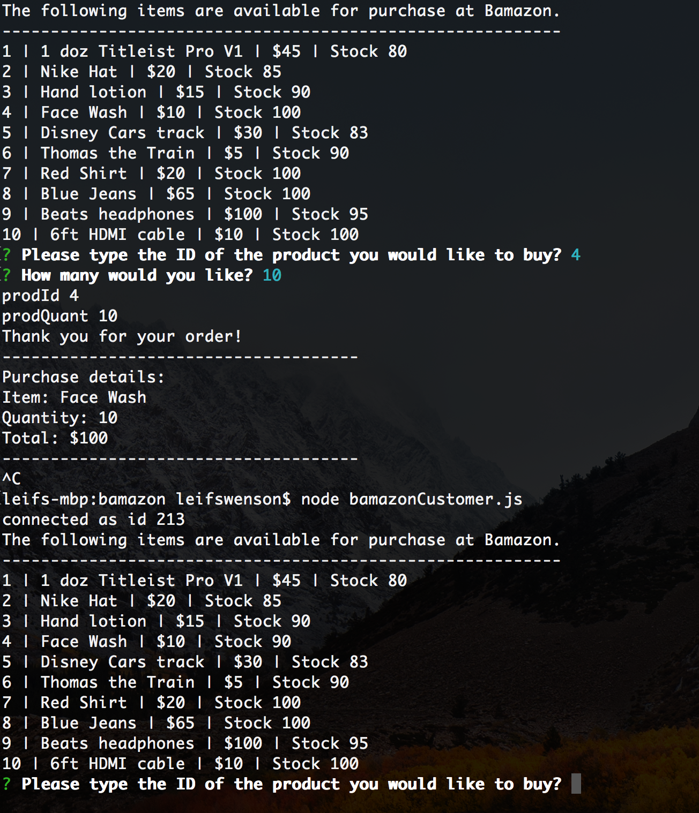

# bamazon

Bmazon is an Amazon-like storefront using MySQL run in the command line. The app takes in orders from customers and depletes stock from the store's inventory.

To run this application the user needs to first run: node bamazonCustomer.js

The user is then prompted with two messages.
1 The first asks for the ID of the product the user would like to purchase.
2 The second asks how many units of the product the user would like to purchase.

If stock is low the user will be met with an insufficient quantity alert. 

After the user has placed the order, the user will be given the total of their order.

